# RLM vs. Standard Agents (Claude Code, Codex, etc.)

This document outlines the fundamental differences between **Recursive Language Models (RLMs)** and standard agentic workflows (like Claude Code, context folding, etc.), based on research by Alex Zhang and his tweet https://x.com/a1zhang/status/2014337263287804260

## The Core Distinction: Symbolic Recursion

The critical difference is not about saving files or using a REPL; it is about **where the control flow lives**.

*   **Standard Agents (Claude Code/Codex):** The **LLM** is the control flow. To iterate over tasks, the LLM must sequentially generate a tool call for every single iteration.
*   **RLM:** The **Interpreter (REPL)** is the control flow. The LLM writes a program (a loop), and the *program* handles the iteration and spawning of sub-agents.

This enables **Symbolic Recursion**: the ability to embed a recursive call to an AI model *inside* a block of logic (like a `for` loop or `if` statement) that is executed by a computer, not the AI.

---

## Visualizing the Comparison: The "1 Million Files" Task

### 1. Standard Agent Case (Claude Code / Codex)
*Reliance on "Linear Generation"*

In this scenario, the agent is manually "driving" the iteration. It has to stay awake and focused enough to output a tool call for every single file.

```mermaid
sequenceDiagram
    participant User
    participant Model
    participant Tool

    User->>Model: "Check 1M files for a weird property."
    
    rect rgb(50, 20, 20)
    note right of Model: Model Generation Cycle (Repeats 1M times)
    Model->>Tool: scan_file("file_1")
    Tool-->>Model: "Nothing found"
    Model->>Tool: scan_file("file_2")
    Tool-->>Model: "Nothing found"
    Model->>Tool: ...
    end

    Note over Model: Context Window Fills Up & Rot Occurs
    Model--xUser: *Hallucinates or Fails*
```

**The Problem:** The LLM acts as the for-loop. If the context window fills up, or the model loses "focus," the loop breaks. "Context Folding" here is usually just summarizing history, which is lossy and prone to error at scale.

### 2. The RLM Case
*Reliance on "Programmatic Execution"*

The agent acts as the *programmer*, offloading repetitive logic to a runtime environment that is guaranteed to be correct (e.g., Python).

```mermaid
sequenceDiagram
    participant User
    participant Model
    participant REPL
    participant SubAgent

    User->>Model: "Check 1M files for a weird property."
    Model->>REPL: Writes & Executes Python Loop
    
    rect rgb(20, 50, 20)
    note right of REPL: REPL Execution Cycle (Hidden from Model)
    loop For each file
        REPL->>SubAgent: sub_agent_check(file_i)
        SubAgent-->>REPL: boolean result
    end
    end

    REPL-->>Model: Returns filtered list [file_x, file_y...]
    Note over Model: Context is Clean
    Model->>User: "Here is the list..."
```

**The Solution:** The main model's context **never grows** regardless of the number of files. It wrote 5 lines of code, and the REPL performed 1 million operations. The context was effectively "folded" into the execution state of the variable `results`.

---

## Summary Table

| Feature | Standard Agents (CC/Codex) | Recursive Language Models (RLM) |
| :--- | :--- | :--- |
| **Control Flow** | The Model (Probabilistic) | The REPL (Deterministic) |
| **Iteration** | Model outputs tool calls sequentially | Model writes a `for` loop |
| **Reliability** | Degrades as task count increases | Constant (Code works for 1 or 1M items) |
| **Sub-Agents** | External tools called by the model | Functions embedded in the programming language |
| **Context** | Grows linearly with steps (must be pruned) | Constant (only the code and final result) |
